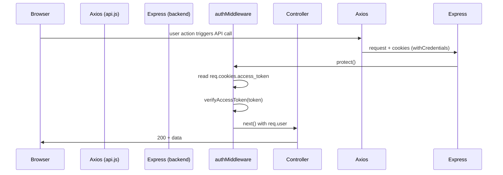
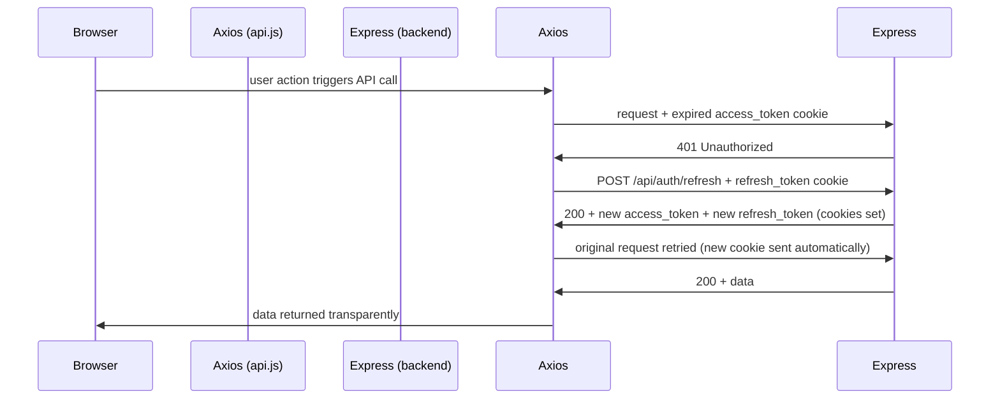
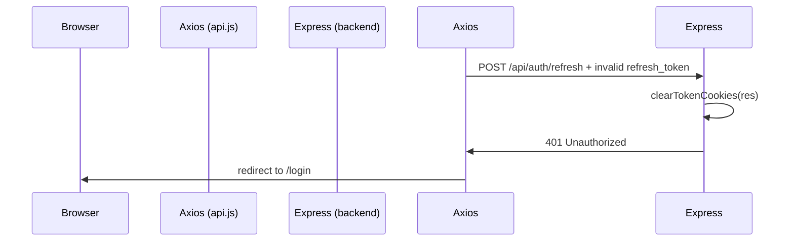

# Design Document — cookie-dual-token-auth

## Overview

This design replaces the existing single-token, `Authorization`-header-based authentication with a
**cookie-based dual-token scheme**. On successful login or registration the system issues two JWTs —
a short-lived **access token** (3-day expiry) and a longer-lived **refresh token** (7-day expiry) —
and stores both in `httpOnly` cookies so that no token value ever lives in JavaScript-accessible
storage (no `localStorage`, no `sessionStorage`).

A dedicated `POST /api/auth/refresh` endpoint rotates the refresh token on every use
(**rolling refresh**), so an active user's session never expires. The frontend Axios instance
transparently intercepts 401 responses, attempts a single refresh-and-retry, and only redirects to
`/login` when the refresh itself fails.

All signing, verification, and cookie-setting logic is centralised in a new
`backend/src/services/tokenService.js` module, giving the codebase a single authoritative place for
token management.

### Key Motivations

- **XSS resistance** — `httpOnly` cookies cannot be read by injected JavaScript, removing the most
  common token-theft vector.
- **CSRF mitigation** — `sameSite: "strict"` and `secure: true` (in production) prevent
  cross-origin cookie submission.
- **Transparent session renewal** — the refresh-retry interceptor means users never see a mid-flow
  logout caused by an expired access token.
- **Cohesion** — a dedicated `tokenService` eliminates scattered `jwt.sign` / `res.cookie` calls
  across multiple files.

---

## Architecture

### Request Flow — Normal (Access Token Valid)



### Request Flow — Access Token Expired (Refresh Succeeds)



### Request Flow — Refresh Token Expired



### Login / Register Flow

```mermaid
sequenceDiagram
    participant Browser
    participant Axios
    participant authController
    participant tokenService

    Browser->>Axios: POST /api/auth/login {email, password}
    Axios->>authController: login()
    authController->>authController: validate credentials
    authController->>tokenService: signAccessToken(userId)
    authController->>tokenService: signRefreshToken(userId)
    authController->>tokenService: setTokenCookies(res, accessToken, refreshToken)
    authController->>Axios: 200 { user: {...} }  (no token in body)
    Axios->>Browser: user object; cookies set by browser from Set-Cookie headers
```

---

## Components and Interfaces

### 1. `backend/src/services/tokenService.js` (new file)

The single source of truth for all token operations.

```js
/**
 * Signs an access JWT for the given user ID.
 * @param {string} userId
 * @returns {string} signed JWT — expires in exactly 3 days
 */
export function signAccessToken(userId) { ... }

/**
 * Signs a refresh JWT for the given user ID.
 * @param {string} userId
 * @returns {string} signed JWT — expires in 7 days
 */
export function signRefreshToken(userId) { ... }

/**
 * Verifies an access token and returns the decoded payload.
 * @param {string} token
 * @returns {{ id: string, iat: number, exp: number }}
 * @throws {JsonWebTokenError | TokenExpiredError}
 */
export function verifyAccessToken(token) { ... }

/**
 * Verifies a refresh token and returns the decoded payload.
 * @param {string} token
 * @returns {{ id: string, iat: number, exp: number }}
 * @throws {JsonWebTokenError | TokenExpiredError}
 */
export function verifyRefreshToken(token) { ... }

/**
 * Sets the access_token and refresh_token httpOnly cookies on the response.
 * @param {import('express').Response} res
 * @param {string} accessToken
 * @param {string} refreshToken
 */
export function setTokenCookies(res, accessToken, refreshToken) { ... }

/**
 * Clears the access_token and refresh_token cookies from the response.
 * @param {import('express').Response} res
 */
export function clearTokenCookies(res) { ... }
```

**Cookie options applied by `setTokenCookies`:**

| Option     | Value                                     |
|------------|-------------------------------------------|
| `httpOnly` | `true`                                    |
| `sameSite` | `"strict"`                                |
| `secure`   | `true` when `NODE_ENV === "production"`, else `false` |
| `maxAge`   | `access_token`: 3 days in ms; `refresh_token`: 7 days in ms |

---

### 2. `backend/src/controllers/authController.js` (modified)

Removes the inline `generateToken` helper and delegates to `tokenService`. Adds a `refresh` handler.

| Export     | Route                    | Change                                                                 |
|------------|--------------------------|------------------------------------------------------------------------|
| `register` | `POST /api/auth/register`| Calls `setTokenCookies`; removes `token` from response body            |
| `login`    | `POST /api/auth/login`   | Calls `setTokenCookies`; removes `token` from response body            |
| `refresh`  | `POST /api/auth/refresh` | New — reads `req.cookies.refresh_token`, rotates tokens, returns user  |
| `logout`   | `POST /api/auth/logout`  | Calls `clearTokenCookies` instead of no-op                             |
| `getMe`    | `GET /api/auth/me`       | Unchanged (still behind `protect` middleware)                          |

---

### 3. `backend/src/middleware/authMiddleware.js` (modified)

Reads the access token from `req.cookies.access_token` instead of the `Authorization` header.
Delegates verification to `tokenService.verifyAccessToken`.

```
Before: const token = req.headers.authorization.split(" ")[1];
After:  const token = req.cookies.access_token;
```

Error messages remain unchanged to avoid breaking any client-side checks:
- No cookie → `"Not authorized, no token"` (401)
- Invalid/expired → `"Token invalid or expired"` (401)

---

### 4. `backend/src/routes/auth.js` (modified)

- Adds `POST /api/auth/refresh` — **no auth middleware** (the refresh_token cookie is its own credential).
- Removes `protect` from `POST /api/auth/logout` — logout must succeed even with an expired or absent access token.

```js
router.post("/register", register);
router.post("/login",    login);
router.post("/refresh",  refresh);      // NEW
router.get("/me",        protect, getMe);
router.post("/logout",   logout);       // protect removed
```

---

### 5. `backend/src/app.js` (modified)

Registers `cookie-parser` **before** all route handlers so that `req.cookies` is populated.

```js
import cookieParser from "cookie-parser";
// ...
app.use(cookieParser());  // must precede route registration
```

---

### 6. `frontend/src/services/api.js` (modified)

Replaces the `localStorage`-based request interceptor with a cookie-aware refresh-retry interceptor.

**Request interceptor** — removed entirely (cookies are sent automatically by the browser when
`withCredentials: true`; no `Authorization` header is needed).

**Response interceptor logic:**

```
on 401:
  if request URL includes "/api/auth/refresh":
    → redirect to /login immediately (no retry — prevents infinite loop)
  else:
    → POST /api/auth/refresh
    if refresh succeeds:
      → retry the original request (request.retry = true to prevent double-retry)
    if refresh fails with 401:
      → redirect to /login
    if refresh fails with 5xx or network error:
      → propagate the error (do NOT redirect)
```

---

### 7. `frontend/src/context/AuthContext.jsx` (modified)

- Removes all `localStorage` access.
- On mount: calls `GET /api/auth/me` unconditionally (no token check required; cookie is sent by
  the browser automatically).
- `login(userData)` — signature drops the `token` parameter; only sets React state.
- `logout()` — calls `POST /api/auth/logout` then resets state; no `localStorage.removeItem`.

---

### 8. Environment & Package Changes

**`backend/.env`** — add:
```
JWT_REFRESH_SECRET=<long-random-secret>
```

**`backend/package.json`** — add to `dependencies`:
```json
"cookie-parser": "^1.4.6"
```

---

## Data Models

No database schema changes are required. The authentication model remains stateless — tokens are
embedded in cookies and verified on every request without server-side session storage.

### Token Payload Structure

Both access and refresh tokens carry an identical minimal payload to limit the information exposed
in the (base64-decodable) JWT body:

```json
{
  "id": "<MongoDB ObjectId as string>",
  "iat": 1700000000,
  "exp": 1700259200
}
```

The `id` field maps to `User._id`. The `exp` difference between access and refresh tokens:

| Token   | `expiresIn` | `exp − iat`  |
|---------|-------------|--------------|
| Access  | `"3d"`      | 259 200 s    |
| Refresh | `"7d"`      | 604 800 s    |

### Cookie Attributes

| Cookie Name     | `httpOnly` | `sameSite` | `secure` (prod) | `maxAge`        |
|-----------------|------------|------------|------------------|-----------------|
| `access_token`  | `true`     | `strict`   | `true`           | 3 days in ms    |
| `refresh_token` | `true`     | `strict`   | `true`           | 7 days in ms    |

### Sanitized User Object (unchanged)

The shape returned in all auth response bodies:

```json
{
  "id":       "<ObjectId>",
  "username": "string",
  "fullName": "string",
  "email":    "string",
  "avatar":   "string"
}
```

No token fields are ever included in the response body.

---

## Correctness Properties

*A property is a characteristic or behavior that should hold true across all valid executions of a
system — essentially, a formal statement about what the system should do. Properties serve as the
bridge between human-readable specifications and machine-verifiable correctness guarantees.*

---

### Property 1: Access Token Sign-Verify Round Trip

*For any* valid `userId`, calling `signAccessToken(userId)` and then `verifyAccessToken(result)`
SHALL return a decoded payload whose `id` field equals the original `userId`.

**Validates: Requirements 1.1, 1.3**

---

### Property 2: Refresh Token Sign-Verify Round Trip

*For any* valid `userId`, calling `signRefreshToken(userId)` and then `verifyRefreshToken(result)`
SHALL return a decoded payload whose `id` field equals the original `userId`.

**Validates: Requirements 1.2, 1.4**

---

### Property 3: Access Token Expiry Is Exactly 3 Days

*For any* `userId`, the access token produced by `signAccessToken(userId)` SHALL have an `exp`
claim that is exactly 3 days (259 200 seconds) greater than its `iat` claim.

**Validates: Requirements 1.1**

---

### Property 4: Refresh Token Expiry Is Exactly 7 Days

*For any* `userId`, the refresh token produced by `signRefreshToken(userId)` SHALL have an `exp`
claim that is exactly 7 days (604 800 seconds) greater than its `iat` claim.

**Validates: Requirements 1.2**

---

### Property 5: Secret Isolation — Cross-Verification Throws

*For any* `userId`, a token produced by `signAccessToken` SHALL NOT be successfully verified by
`verifyRefreshToken`, and a token produced by `signRefreshToken` SHALL NOT be successfully
verified by `verifyAccessToken`. Both cross-verification calls SHALL throw.

**Validates: Requirements 1.8**

---

### Property 6: Invalid Tokens Are Rejected

*For any* token string that has been tampered with (one character mutated, a different secret used,
or a structurally invalid string), both `verifyAccessToken` and `verifyRefreshToken` SHALL throw
rather than returning a payload.

**Validates: Requirements 1.3, 1.4**

---

### Property 7: Register/Login Response Body Contains No Token Fields

*For any* valid registration or login input, the response body returned by the `register` and
`login` controllers SHALL contain a `user` object with exactly the sanitized fields (`id`,
`username`, `fullName`, `email`, `avatar`) and SHALL NOT contain any field named `token`,
`accessToken`, `refreshToken`, or any JWT string value.

**Validates: Requirements 2.3, 2.4**

---

### Property 8: Failed Auth Requests Set No Cookies

*For any* invalid registration or login payload (missing required fields, duplicate username/email,
wrong password), the controller SHALL return a 4xx status and the response SHALL have no
`Set-Cookie` headers.

**Validates: Requirements 2.5**

---

### Property 9: Refresh Endpoint Issues New Tokens (Rolling Refresh)

*For any* valid `userId`, after calling the refresh endpoint with a legitimately issued
`refresh_token` cookie, the newly set `access_token` and `refresh_token` cookie values SHALL differ
from the originals (because timestamps and random jitter in JWT signing produce distinct tokens).

**Validates: Requirements 3.1, 3.2, 3.5**

---

### Property 10: Invalid Refresh Token Returns 401 and Clears Cookies

*For any* absent, tampered, or expired `refresh_token` cookie value presented to
`POST /api/auth/refresh`, the endpoint SHALL return a 401 status and the response SHALL include
`Set-Cookie` headers that clear both the `access_token` and `refresh_token` cookies.

**Validates: Requirements 3.4**

---

### Property 11: Logout Always Clears Cookies and Returns 200

*For any* request state — valid token, expired token, or absent token — a call to
`POST /api/auth/logout` SHALL return HTTP 200 with a confirmation message and SHALL include
`Set-Cookie` headers that clear both cookies.

**Validates: Requirements 4.1, 4.2, 4.3**

---

### Property 12: Auth Middleware Rejects All Invalid Token Variants

*For any* request that arrives at a protected route with an absent `access_token` cookie, an
expired token, or a token signed with the wrong secret, the `protect` middleware SHALL return 401
with the appropriate error message and SHALL NOT call `next()`.

**Validates: Requirements 5.2, 5.3**

---

### Property 13: Auth Middleware Attaches User for Valid Tokens

*For any* `userId` that corresponds to an existing database user, a request to a protected route
carrying a valid `access_token` cookie SHALL result in `req.user` being populated with that user's
data (excluding the `password` field) and `next()` being called.

**Validates: Requirements 5.4**

---

### Property 14: 401 Interceptor Calls Refresh Exactly Once Per Failed Request

*For any* non-refresh API endpoint that returns a 401 response, the Axios response interceptor
SHALL make exactly one call to `POST /api/auth/refresh` and then retry the original request exactly
once. A second 401 on the same original request SHALL NOT trigger another refresh cycle.

**Validates: Requirements 6.4, 6.5**

---

### Property 15: Refresh Endpoint 401 Triggers Redirect Without Loop

*For any* 401 response received specifically from `POST /api/auth/refresh`, the interceptor SHALL
redirect to `/login` immediately and SHALL NOT make any further calls to the refresh endpoint.

**Validates: Requirements 6.7**

---

### Property 16: Auth Context Session State Reflects /api/auth/me Response

*For any* user object returned by a successful `GET /api/auth/me` response, the Auth Context's
`user` state SHALL equal that object and `isLoggedIn` SHALL be `true`. For any error response from
`/api/auth/me`, `user` SHALL be `null` and `isLoggedIn` SHALL be `false`.

**Validates: Requirements 7.2, 7.3**

---

### Property 17: Logout Resets All Auth State

*For any* authenticated context state (non-null `user`, `isLoggedIn: true`), calling the `logout`
function SHALL always call `POST /api/auth/logout`, then set `user` to `null` and `isLoggedIn` to
`false`, regardless of whether the API call succeeds or fails.

**Validates: Requirements 7.5**

---

## Error Handling

### Backend

| Scenario | Response |
|---|---|
| Missing/invalid registration fields | `400 { message: "All fields are required" }` |
| Duplicate username | `409 { message: "Username already taken" }` |
| Duplicate email | `409 { message: "Email already registered" }` |
| Wrong login credentials | `401 { message: "Invalid credentials" }` |
| Missing email/password on login | `400 { message: "Email and password required" }` |
| Missing `access_token` cookie on protected route | `401 { message: "Not authorized, no token" }` |
| Invalid/expired `access_token` | `401 { message: "Token invalid or expired" }` |
| Missing/invalid `refresh_token` on `/refresh` | `401 + clearTokenCookies` |
| Unhandled server error | `500` via `errorHandler` middleware |

### Frontend

| Scenario | Behavior |
|---|---|
| 401 on any non-refresh endpoint | Call `POST /api/auth/refresh`, retry original once |
| 401 on `/api/auth/refresh` itself | Redirect to `/login` immediately, no retry |
| 5xx or network error on refresh | Propagate error to caller, no redirect |
| `/api/auth/me` error on mount | `isLoggedIn = false`, `user = null`, render app unauthenticated |
| Logout API call failure | Ignore; always reset client state to logged-out |

### Token Generation Failure on Refresh

If `signAccessToken` or `signRefreshToken` throws after a valid refresh token has been verified
(e.g., missing `JWT_SECRET` environment variable), the `refresh` handler catches the error and
returns `200` with the user data. The old cookies remain active until their natural expiry. This
prevents a misconfigured deployment from forcibly logging out all active users; however, new tokens
will not be issued until the environment is corrected. The error is passed to the Express error
handler so it appears in server logs.

---

## Testing Strategy

### Unit Tests

Focus on concrete examples and edge cases, complementing property tests.

**`tokenService`**
- Sign functions produce strings of three dot-separated segments (JWT structure check)
- `setTokenCookies` called with `NODE_ENV=production` sets `secure: true`
- `setTokenCookies` called without production env sets `secure: false`
- `clearTokenCookies` calls `res.clearCookie` for both cookie names

**`authController`**
- `getMe` returns the sanitized user object already on `req.user`
- `refresh` with a missing `refresh_token` cookie returns 401
- `register` with a duplicate email returns 409 with no cookies set

**`authMiddleware`**
- Request with a valid token in cookie (not Authorization header) passes through

**`AuthContext`**
- `login(userData)` updates `user` and `isLoggedIn` with the provided object (no token param)
- `/api/auth/me` network error on mount leaves context in logged-out state

### Property-Based Tests

Uses **fast-check** (JavaScript) for the backend token service and interceptor logic, and
**fast-check** with React Testing Library for the frontend context.

Each property test runs a minimum of **100 iterations**.

| Property | Test tag |
|---|---|
| Property 1 | `Feature: cookie-dual-token-auth, Property 1: access token sign-verify round trip` |
| Property 2 | `Feature: cookie-dual-token-auth, Property 2: refresh token sign-verify round trip` |
| Property 3 | `Feature: cookie-dual-token-auth, Property 3: access token expiry is exactly 3 days` |
| Property 4 | `Feature: cookie-dual-token-auth, Property 4: refresh token expiry is exactly 7 days` |
| Property 5 | `Feature: cookie-dual-token-auth, Property 5: secret isolation cross-verification throws` |
| Property 6 | `Feature: cookie-dual-token-auth, Property 6: invalid tokens are rejected` |
| Property 7 | `Feature: cookie-dual-token-auth, Property 7: register/login response body contains no token fields` |
| Property 8 | `Feature: cookie-dual-token-auth, Property 8: failed auth requests set no cookies` |
| Property 9 | `Feature: cookie-dual-token-auth, Property 9: refresh endpoint issues new tokens` |
| Property 10 | `Feature: cookie-dual-token-auth, Property 10: invalid refresh token returns 401 and clears cookies` |
| Property 11 | `Feature: cookie-dual-token-auth, Property 11: logout always clears cookies and returns 200` |
| Property 12 | `Feature: cookie-dual-token-auth, Property 12: auth middleware rejects all invalid token variants` |
| Property 13 | `Feature: cookie-dual-token-auth, Property 13: auth middleware attaches user for valid tokens` |
| Property 14 | `Feature: cookie-dual-token-auth, Property 14: 401 interceptor calls refresh exactly once` |
| Property 15 | `Feature: cookie-dual-token-auth, Property 15: refresh endpoint 401 triggers redirect without loop` |
| Property 16 | `Feature: cookie-dual-token-auth, Property 16: auth context session state reflects /api/auth/me` |
| Property 17 | `Feature: cookie-dual-token-auth, Property 17: logout resets all auth state` |

### Integration Tests

- Full login → protected route → logout flow using a real (test) MongoDB connection and
  `supertest`, verifying cookies are set and cleared on the HTTP response headers.
- Full login → wait for access token expiry (mock timers) → automatic refresh → protected route
  access, end-to-end.
- Verify `cookie-parser` is registered and `req.cookies` is populated before route handlers run.

### Security Considerations to Verify

- Tokens are never echoed in response bodies (covered by Property 7).
- `httpOnly` attribute prevents JavaScript reads — verifiable in browser DevTools / integration test
  asserting `Set-Cookie` headers contain `HttpOnly`.
- `sameSite: strict` prevents CSRF — verifiable by asserting cookie header value in integration
  tests.
- No `Authorization` header is sent from the frontend (covered by unit test on Axios instance
  configuration).
